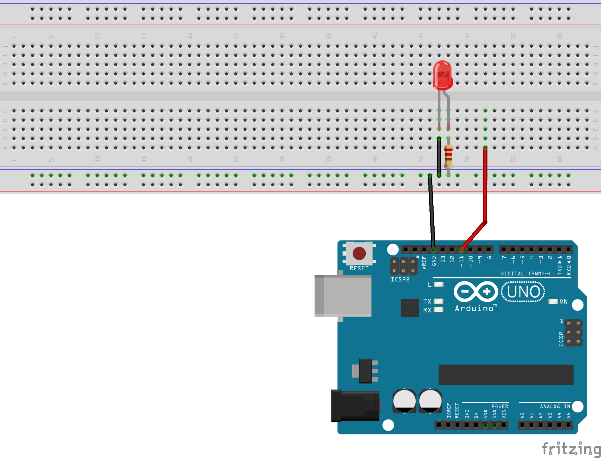
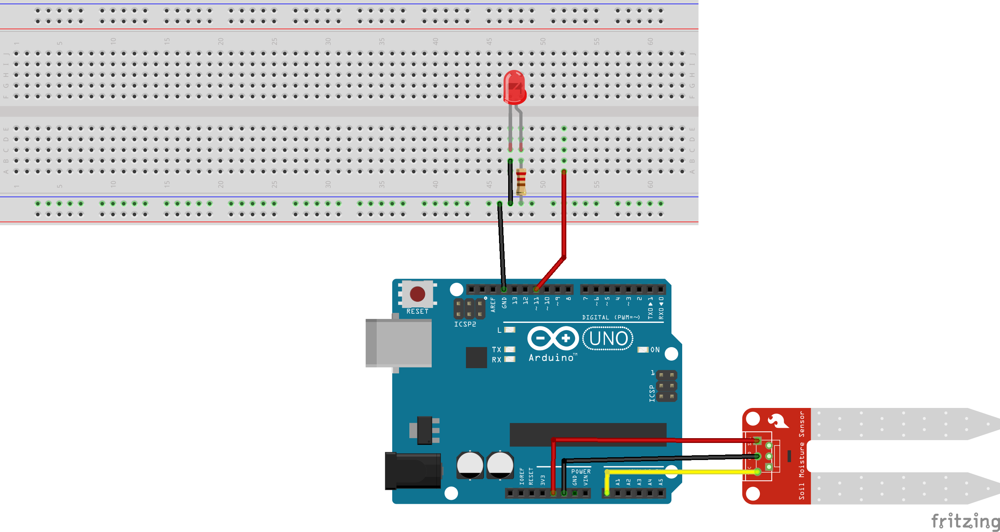
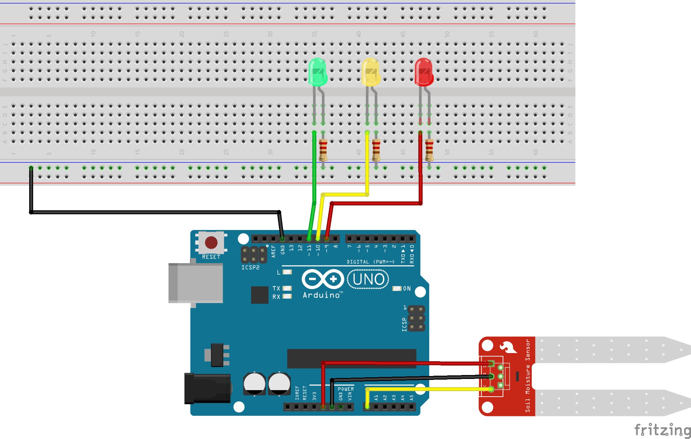

A workshop to learn how to use Arduino and some sensors to create a DIY plant hygrometer.

## Chapter 1 & Chapter 2



The aim here is first to light a led. Then, it would be interesting to make it blink.

Here is a first piece of code:
```arduino
const int LED_PIN = 11;
const int LED_BLINK_DELAY = 1000;

void setup() {
    // TODO
}

void loop() {
    // TODO
}
```

You can use the function [`pinMode`](https://www.arduino.cc/reference/en/language/functions/digital-io/pinmode/) pour  et [`digitalWrite`](https://www.arduino.cc/reference/en/language/functions/digital-io/digitalwrite/). 

The first allows you to configure the inputs/outputs to be managed. The second allows you to write a `HIGH` value, corresponding to 5V in our case, or a `LOW` value, corresponding to 0V, i.e. ground.
  
## Chapter 3



Here, we'll try to switch on the LED when the humidity level returned by the hygrometric sensor is too low.

```arduino
const int LED_PIN = 11;
const int LED_BLINK_DELAY = 1000;
const int HYGRO_ANALOG = A0;
const int BAUD_RATE = 9600;


void serialPrintAnalog(int value) {
  // TODO
}

void switchLedOnLowHumidity() {
  // TODO
}


void setup() {
  Serial.begin(BAUD_RATE);
  // TODO 
}

void loop() {
  serialPrintAnalog(HYGRO_ANALOG);
  switchLedOnLowHumidity();
}
```

To retrieve the humidity level, you'll need the [`analogRead`](https://www.arduino.cc/reference/en/language/functions/analog-io/analogread/) function. The value is linked to analog pin `A0`.

## Chapter 4



Finally, we'll complete the humidity display management with 3 LEDs (RGB). The LEDs will light up according to the following conditions:
- Red : value < 50
- Yellow : 50 >= value < 100
- Green : value >= 100
